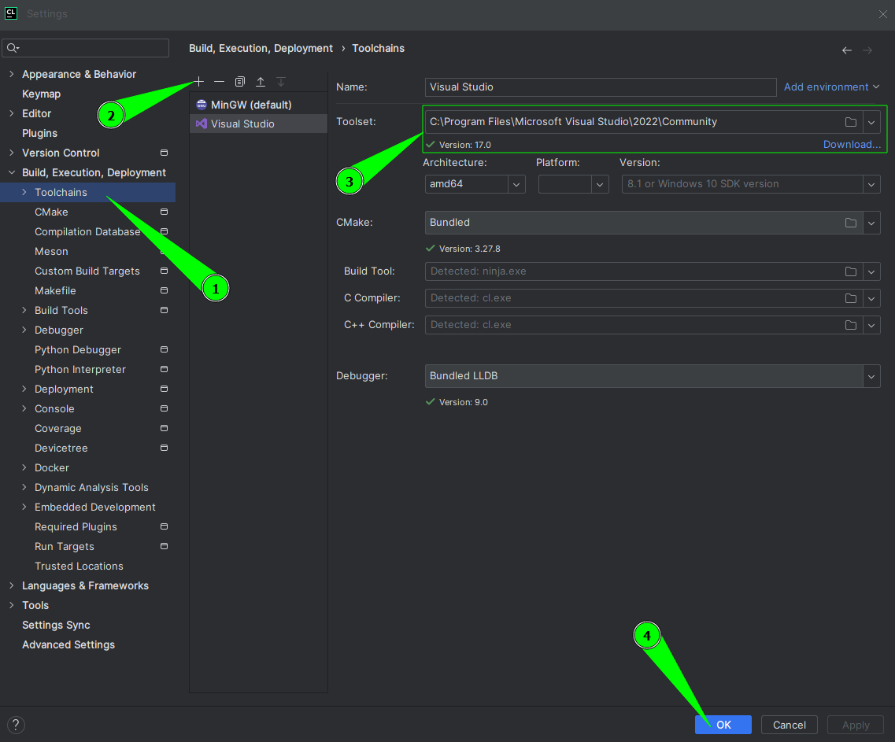

# GraphicLibrary

## 1. Install VisualStudio

Before anything we need to set up our C/C++ compilation environment, we are going to use 
Windows official compiler, you can download it from:

* [Visual Studio Code](https://visualstudio.microsoft.com/es/downloads/)

After installing it we can use Visual Studio Code for developing or use another IDE.

CLion from JetBeans is an excellent option for this, CLion has a great CMake manage and it 
is easy to use:

* [Download CLion](https://www.jetbrains.com/clion/download)

Once everything is downloaded and installed, then we need to configure Windows Compiles as our project compiler, 
by default CLion takes MingGW as default compiler:




## 2. Set CMake options:

### DEBUG MODE:

```
-DBUILD_SHARED_LIBS=OFF
-DSDL3IMAGE_GIF:BOOL=OFF
-DSDL3IMAGE_LBM:BOOL=OFF
-DSDL3IMAGE_PCX:BOOL=OFF
-DSDL3IMAGE_PNM:BOOL=OFF
-DSDL3IMAGE_QOI:BOOL=OFF
-DSDL3IMAGE_SVG:BOOL=OFF
-DSDL3IMAGE_TGA:BOOL=OFF
-DSDL3IMAGE_XCF:BOOL=ON
-DSDL3IMAGE_XPM:BOOL=ON
-DSDL3IMAGE_XV:BOOL=ON
-DSDL3MIXER_OPUS:BOOL=OFF
-DSDL3MIXER_OPUS_SHARED:BOOL=OFF
-DSDL3MIXER_WAVE:BOOL=OFF
-DSDL3MIXER_WAVPACK:BOOL=OFF
-DSDL3MIXER_WAVPACK_SHARED:BOOL=OFF
-DSDL3MIXER_MOD:BOOL=OFF
-DSDL3MIXER_MOD_XMP:BOOL=OFF
-DSDL3MIXER_MOD_XMP_SHARED:BOOL=OFF
-DSDL3MIXER_GME:BOOL=OFF
-DSDL3MIXER_MP3_MPG123:BOOL=OFF
-DSDL3MIXER_VORBIS:STRING=STB
-DSDL3MIXER_MP3_DRMP3:BOOL=OFF
-DSDL3MIXER_MP3_MPG123_SHARED:BOOL=OFF
-DSDL3MIXER_MP3:BOOL=OFF 
```

### RELEASE MODE:

```
-DSDL3IMAGE_GIF:BOOL=OFF
-DSDL3IMAGE_LBM:BOOL=OFF
-DSDL3IMAGE_PCX:BOOL=OFF
-DSDL3IMAGE_PNM:BOOL=OFF
-DSDL3IMAGE_QOI:BOOL=OFF
-DSDL3IMAGE_SVG:BOOL=OFF
-DSDL3IMAGE_TGA:BOOL=OFF
-DSDL3IMAGE_XCF:BOOL=ON
-DSDL3IMAGE_XPM:BOOL=ON
-DSDL3IMAGE_XV:BOOL=ON
-DSDL3MIXER_OPUS:BOOL=OFF
-DSDL3MIXER_OPUS_SHARED:BOOL=OFF
-DSDL3MIXER_WAVE:BOOL=OFF
-DSDL3MIXER_WAVPACK:BOOL=OFF
-DSDL3MIXER_WAVPACK_SHARED:BOOL=OFF
-DSDL3MIXER_MOD:BOOL=OFF
-DSDL3MIXER_MOD_XMP:BOOL=OFF
-DSDL3MIXER_MOD_XMP_SHARED:BOOL=OFF
-DSDL3MIXER_GME:BOOL=OFF
-DSDL3MIXER_MP3_MPG123:BOOL=OFF
-DSDL3MIXER_VORBIS:STRING=STB
-DSDL3MIXER_MP3_DRMP3:BOOL=OFF
-DSDL3MIXER_MP3_MPG123_SHARED:BOOL=OFF
-DSDL3MIXER_MP3:BOOL=OFF
```

## 3. Compile